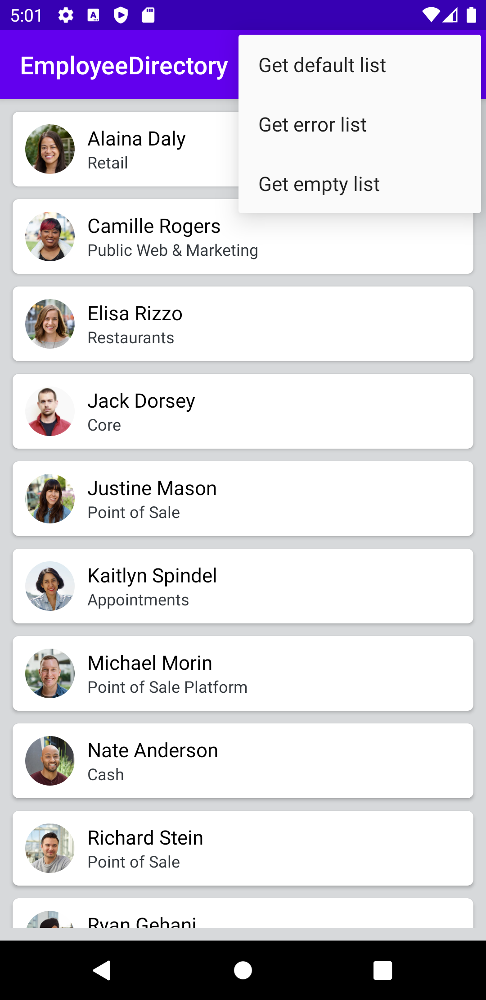

# EmployeeDirectory

## Functionality

Employee directory app that shows a list of employees parsed from the provided JSON endpoint.

## Structure:
Some os the components used are:

- MVVM Architecture.
- Koin - for dependency injection.
- Coroutines - for asynchronous programming on Android, as network calls and access to database.
- Retrofit - for the network calls.
- Gson - for the deserialization.
- Glide - for image loading and cache.
- RecyclerView - for displaying list of employees.
- ConstraintLayout - for the layout design.
- CardView - for the layout design.

## Focus area:
On this project I was more focus on the architecture and data flow. To facilitate the tests I included a menu to trigger
the different apis (success, error and empty list).

## Classes from other projects:
Some classes I used from other personal projects, as the :
RetrofitFactory, CustomApplication, GlideModule and SingleEventWrapper.

## Models:
On EmployeeDTO is a function to check if the required fields are != null to validate de DTO.

## Views:
For the view it is using one Activity, which is hosting one fragments.
- MainFragment : 

It is displaying the list of Employees(picture, name and team), and a menu to simulate the 3 different apis.
 
 

## Run the app:

No update is necessary, you can just clone the project and run it.

